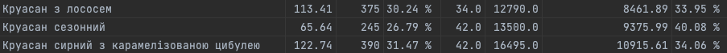

# Foodcoster

Foodcoster is a search engine for the Poster restaurant automation system. It is designed to generate reports in CSV format, including business logic data, for further handling with other UI-UX friendly projects. 

It helps to monitor relevance and adequacy of pricing of your business products and correctly work with the liquidity of the market of ingredients, semi-finished products and goods.

## Features

Foodcoster provides the following functionalities:
- Retrieves data on all existing products.
- Fetches their costs and prices.
- Gathers sales statistics, including sales in pieces, gross profit, and profit.
- Calculates and merges with existing item statistics:
  - Expected cost.
  - Real, actual cost of the item for the business, including discounts.

## Requirements
 - Python 3+ on your machine 

## Installation

1. Clone the repository:
    ```bash
    git clone https://github.com/VanyaPerepelka/foodcoster.git
    cd foodcoster
    ```
2. Install the required dependencies:
    ```bash
    pip install -r requirements.txt
    ```

## Usage

You can run Foodcoster from the command line using the following command:

```bash
python3 main.py -l yourlogin@mail.com -p yourAdminPassword -n YourProjectName -d 14
```

### Command Line Arguments

- -l or --login: Provide the login for the Poster admin panel.
- -p or --password: Provide the password associated with the Poster login.
- -n or --name: Provide the name of your project in the Poster network.
- -d or --days: Specify how many days ago to start accounting. (Optional. Default value - one week) 

### Output
The script generates a CSV file named final_report_{days}.csv containing the report data in format:

unit_name, unit_cost, unit_price, expected_cost, sales_in_pieces, gross_profit, profit, natural_food_cost



## Future Enhancements
Foodcoster will be integrated into a Telegram bot for enhanced UI-UX friendliness.
Additionally, it will be expanded with tools to work with existing Google Sheets for better data management and visualization.

## Contributing
Contributions are welcome! Please follow these steps to contribute:

1. Fork the repository.
2. Create a new branch (git checkout -b feature/your-feature-name).
3. Make your changes.
4. Commit your changes (git commit -m 'Add some feature').
5. Push to the branch (git push origin feature/your-feature-name).
6. Open a pull request.

### Contact
If you have any questions or need further assistance, feel free to contact me vanyapelepelkaaa@gmail.com

